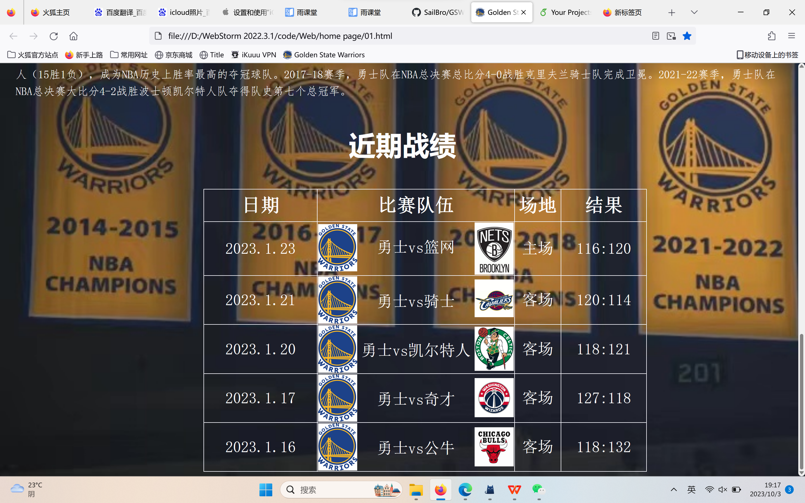
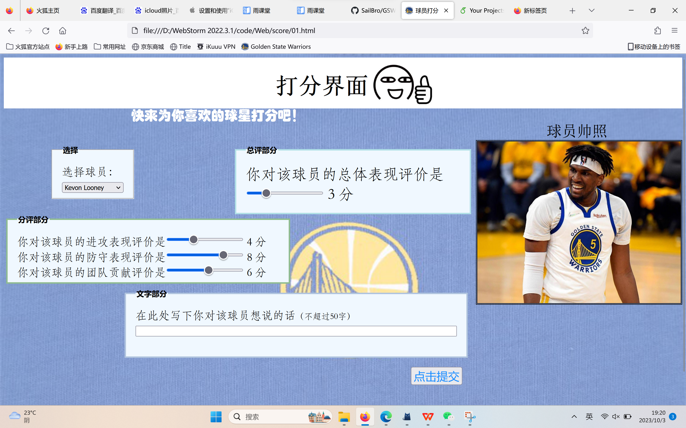

# GSW-Web——金州勇士队官网（简易版）制作
- 前端个人兴趣尝试
- 编程语言：HTML、CSS、Javascript
- 制作时间：2023年大年三十~大年初二

## 界面/功能展示
### 首页：球队介绍+近期战绩

### 球员总体界面：选择并点击想了解的球员

### 球员个人界面：球员介绍+下一个球员跳转+点击进入打分界面

### 球员打分界面：选择球员+评分提交

## 待完善功能
预期在后续使用flask框架，建立小型数据库，与web连接，能够收集用户的评分意见，并计算展示相关数据。
